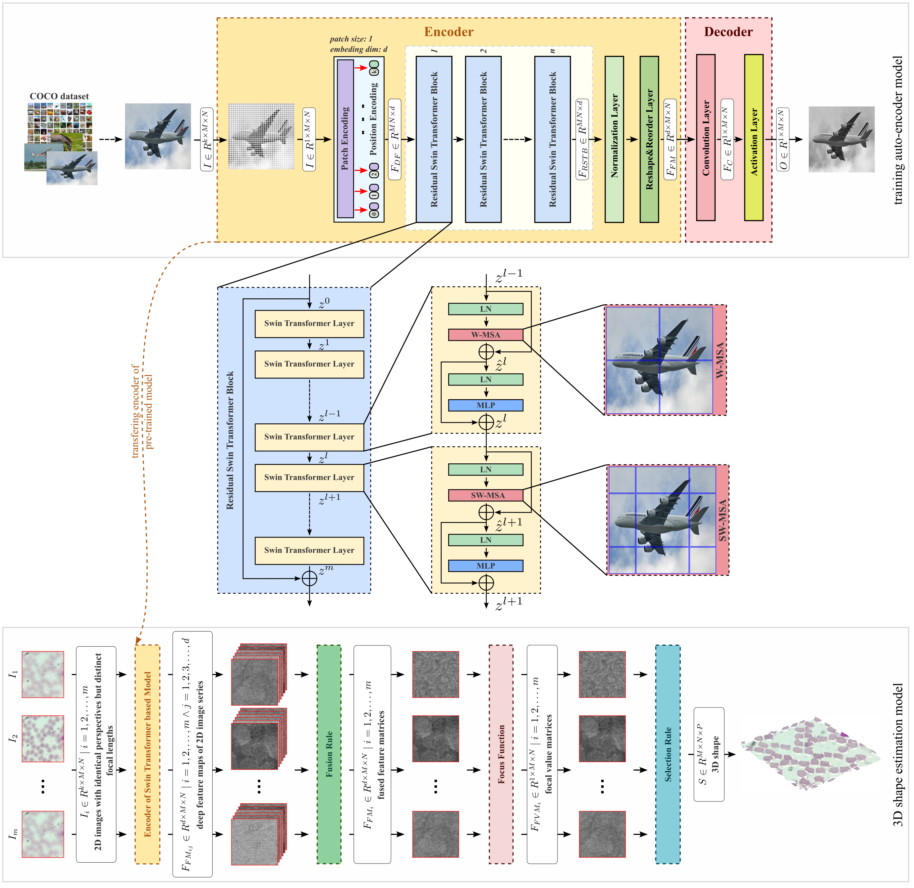

# Swin transformer-based shape-from-focus technique for accurate 3D shape estimation

This repository contains the official source code of the Swin-SFF model proposed in our paper:

**Title:** Swin transformer-based shape-from-focus technique for accurate 3D shape estimation  
**Authors:** Ramazan Ozgur Dogan<sup>a,d</sup>, Hulya Dogan<sup>b,c,d</sup>, Alper Yilmaz<sup>d</sup>  

<sup>a</sup> Department of Artificial Intelligence Engineering, Faculty of Computer and Information Sciences, Trabzon University, Trabzon, Türkiye  
<sup>b</sup> Department of Software Engineering, Faculty of Engineering, Karadeniz Technical University, Trabzon, Türkiye  
<sup>c</sup> Drug and Pharmaceutical Technology Application & Research Center, Karadeniz Technical University, Trabzon, Türkiye  
<sup>d</sup> Photogrammetric Computer Vision Laboratory, The Ohio State University, Columbus, USA  

📅 **Received:** 14 January 2025  
🔄 **Revised:** 6 April 2025  
✅ **Accepted:** 23 May 2025  
🌐 **Available Online:** 30 May 2025  
📚 **Version of Record:** 30 May 2025  
📘 **Journal:** *Optics and Lasers in Engineering*  
📦 **Volume:** 193, October 2025  
🆔 **Article Number:** 109108<br>
🔗 [**DOI:** 10.1016/j.optlaseng.2025.109108](https://doi.org/10.1016/j.optlaseng.2025.109108)<br>
🔗 [**Full Text Link**](https://authors.elsevier.com/a/1lB3bWipgs9cr)

---

## 🧠 Graphical Abstract

<p align="center">
  
</p>

**Swin-SFF** is a novel swin transformer based framework for 3D shape estimation from focus image stacks. It leverages the hierarchical architecture of the Swin Transformer and integrates various focus measure strategies to enable accurate and robust focus level detection. The model performs sharpness evaluation directly in the deep feature space using multi-scale attention mechanisms, which enhance discriminative power in both low-texture and noisy regions. Extensive comparisons with classical and deep SFF techniques show that Swin-SFF consistently outperforms existing approaches in both quantitative and visual evaluations.


---

## 📁 Project Structure

```
SwinSFF/
├── coco/
│   └── train2017/            # COCO dataset images (download manually)
├── models/                   # Trained models and loss logs
│   └── best.model            # Example trained model file
├── outputs/
│   └── simu15/               # Input test images for inference
│       ├── <input images>    # Focus slice images
│       └── output/           # Fused output images
├── sff_strategies.py         # Focus measure definitions (SFF)
├── ssim.py                   # SSIM and MS-SSIM loss (PyTorch)
├── swin_sff.py               # Swin-SFF model
├── swin_transformer.py       # Swin Transformer blocks
├── test.py                   # Inference script
└── train.py                  # Unsupervised training script
```

---

## 🔧 Installation

1. (Optional) Create and activate a virtual environment:

```bash
python3 -m venv swin_sff
source swin_sff/bin/activate
```

2. Install required packages:

```bash
pip install -r requirements.txt
```

---

## 📥 Dataset Setup (COCO)

To train the model using unsupervised learning on the COCO dataset:

1. Download the COCO `train2017` dataset from the [COCO website](https://cocodataset.org/#download).
2. Place the images inside the following directory:

```
SwinSFF/coco/train2017/
```

---

## 🚀 Training

Run the training script as follows:

```bash
python train.py --epochs 25 --batch_size 2 --ssim_index 2
```

Model checkpoints and training losses will be saved in the `models/` directory.

---

## 📦 Training Outputs

Each `.pth` file saved in `models/` includes:
- `state_dict` of the trained model
- History of:
  - L1 (pixel) loss
  - SSIM loss
  - Total combined loss

---

## 🧪 Testing trained model

To test the model on a set of simulated focus images:

1. Put your test images into a folder, for example:

```
SwinSFF/outputs/<your_image_path>/
```

2. Run the test:

```bash
python test.py --imgs_folder outputs/<your_image_path> --model_path models/<your_trained_model_weights>.pth

```

3. The output images (with extended depth of field) will be saved to:

```
# The final fused image with extended depth of field (EDF)
outputs/<your_image_path>/output/fused.png

# Corresponding estimated depth map (saved as a text file)
outputs/<your_image_path>/output/fused.txt               

# Interactive 3D visualization of the fused image with depth map
outputs/<your_image_path>/output/fused3D.html 

# 3D visualization with mean-filtered depth map for smoother surface rendering
outputs/<your_image_path>/output/fused3D_filtered.html   

```

---

## 📦 Acknowledgement

This project includes the use of the `ssim.py` implementation from the open-source repository:

🔗 [VainF/pytorch-msssim](https://github.com/VainF/pytorch-msssim)

We specifically utilize the `MS_SSIM` class from the `ssim.py` file for computing multi-scale structural similarity (MS-SSIM) loss in our training pipeline.

The original repository is licensed under the MIT License, and we acknowledge and appreciate the authors for their open-source contribution.

---

## 📧 Contact

For questions or feedback, please contact:

**Ramazan Ozgur Dogan, PhD**  
Assistant Professor  
Department of Artificial Intelligence Engineering  
Faculty of Computer and Information Sciences  
Trabzon University, Türkiye  
Email: dogan@trabzon.edu.tr

---

## 📄 Citation

This code is shared to support further research—please cite our paper if you find it helpful:

```bibtex
@article{DOGAN2025109108,
title = {Swin transformer-based shape-from-focus technique for accurate 3D shape estimation},
journal = {Optics and Lasers in Engineering},
volume = {193},
pages = {109108},
year = {2025},
issn = {0143-8166},
doi = {https://doi.org/10.1016/j.optlaseng.2025.109108},
url = {https://www.sciencedirect.com/science/article/pii/S0143816625002933},
author = {Ramazan Ozgur Dogan and Hulya Dogan and Alper Yilmaz},
keywords = {3D shape, Deep learning, Shape-from-focus, Swin transformer, Focus function}
}
```
